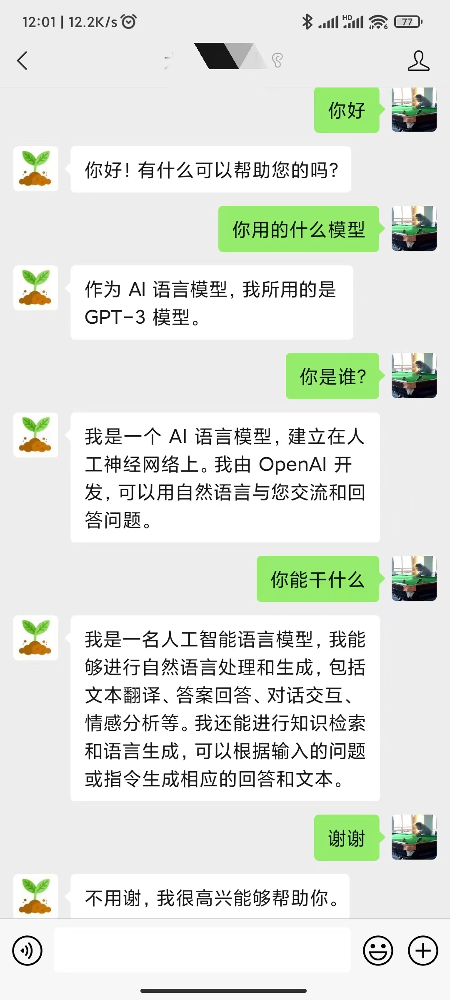

# ChatGPT 微信公众号机器人

把 ChatGPT 接入微信公众号。

## 前置条件

1. OpenAI 账号，并[创建 API Key](https://platform.openai.com/account/api-keys)

1. 微信公众号

1. Python 3.7+

## 运行

1. `pip install -r requirements.txt`

1. `cp .env.example .env`

1. 在 `.env` 文件中，设置 OPENAI_API_KEY 和 WECHAT_TOKEN。

1. `python app.py`

1. 默认会运行在 8888 端口，可以使用 ngrok 把 localhost 服务映射到公网：

    `ngrok http 8888`

1. 根据[微信公众平台开发](https://developers.weixin.qq.com/doc/offiaccount/Basic_Information/Access_Overview.html)的第一步，填写服务器配置：
    
    * URL：ngrok 的 URL + '/robot/'，例如：https://xxxxxx.ngrok.io/robot/
    * Token：前面在 .env 文件中设置的 WECHAT_TOKEN
    * EncodingAESKey：随机生成就行

1. 大功告成！到公众号后台进行互动吧！